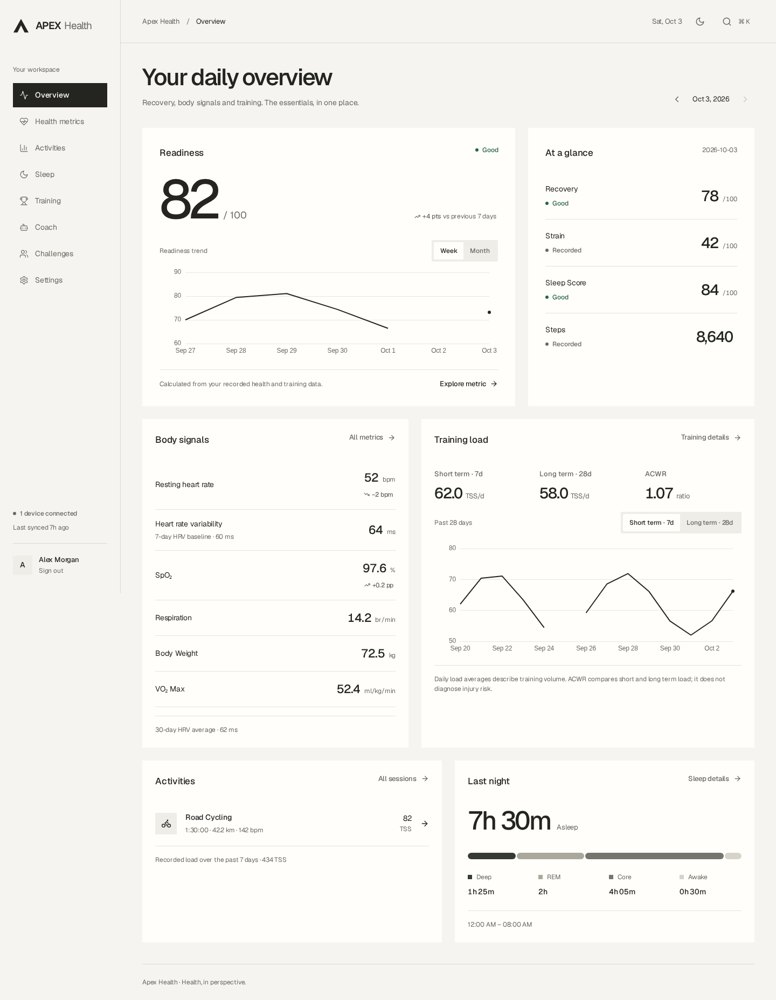
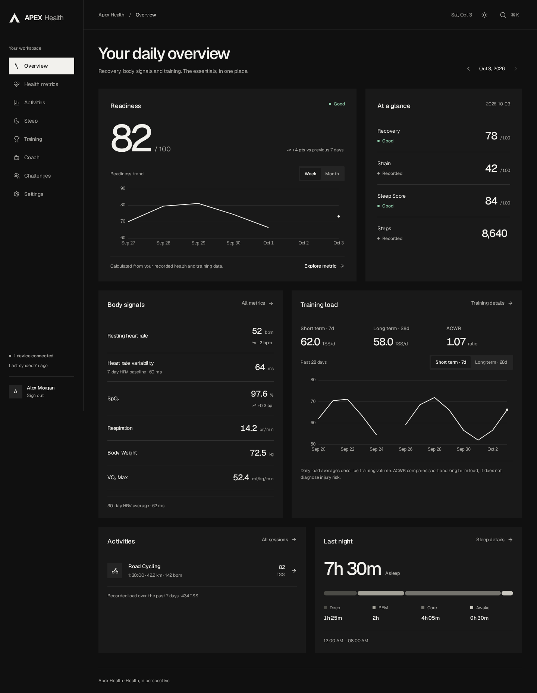
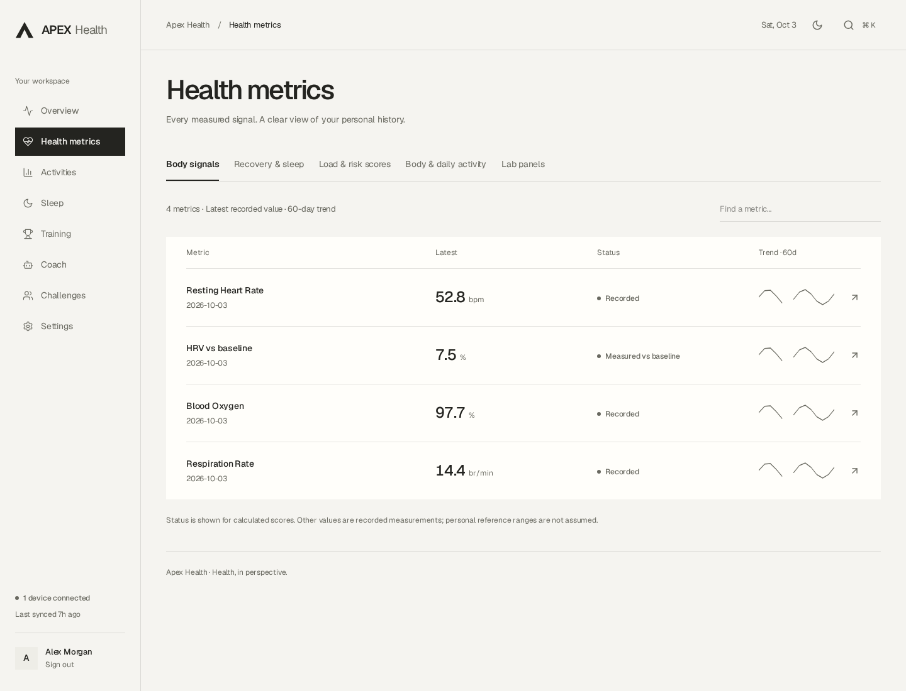
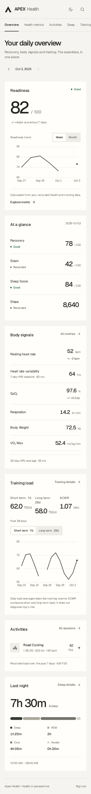

# Authenticated UI redesign

The production FastAPI SPA in frontend/ now uses a Swiss modern visual system:
warm monochrome surfaces, sharp controls, locally bundled Geist, a strong
readiness hierarchy, neutral numbers and restrained status colors.

## Screen coverage

| Screen | Presentation |
|---|---|
| Overview | Readiness hero and calendar trend, recovery/strain/sleep/steps, body signals, training load, alerts, sessions and last night |
| Health metrics | Four metric-group tabs, all 24 catalog metrics, search, latest date/value/status/sparkline; additional catalog keys remain discoverable |
| Metric detail | Single-unit chart, calendar gaps, exact tooltip, latest point, period average, summary and every recorded value |
| Labs | Recorded panels and marker values, panel creation, notes and donation eligibility |
| Activities | Sport tabs, paginated session table, explicit loaded totals and unit conversion |
| Activity detail | Session/lap/source tabs, GPS map, individually scaled recording channels, power, heart rate, elevation, conditions and gear |
| Sleep | Recorded-night averages, duration history and stage composition; night detail, measured epochs and overnight HRV/baseline |
| Training | Today’s gym plan, draft confirmation, explicit reps/weight set logging, rest timer, feedback, upcoming events and load history |
| Coach | Account-scoped drafts, saved conversations, honest provider errors and draft recovery |
| Challenges | Separate challenge and ranking tabs with visible request errors |
| Settings | Profile, preferences, device connections, queued-sync progress, account security and owner-only invites |
| Sign-in/onboarding | Matching visual identity, real session authentication, invite redemption and first-use preferences |

The existing root Next.js prototype is not the production UI. No data is
fabricated by the redesigned SPA. Screenshots and browser fixtures use
synthetic verification records, not the owner’s health data.

## Reliability changes accompanying the design

- Removed invented readiness floors/caps, fake HRV normal bands, unconditional
  “all systems normal”/overreaching claims, synthesized sleep cycles, assumed
  75kg W/kg and session-maximum heart-rate zones.
- Corrected acute/chronic load units and the sleep-score detail label.
- Preserved missing normalized power and missing measurements.
- Separated all activity recording channels by unit; missing calendar samples
  remain chart gaps.
- Added activity pagination and honest partial-summary labels.
- Garmin sync polls the account-owned backend job until completion, survives
  reload and refreshes the correct data-query families.
- Coach errors retain the submitted draft; browser drafts and pending sync IDs
  are account-scoped.
- Account theme/locale changes update both the UI store and query cache.
  Failed saves roll back with visible feedback; conflicting preference saves
  are disabled while a request is pending.
- Authentication clears cached account data. Backend availability errors retain
  a retry screen instead of sending a signed-in user to login.
- Keyboard search traps and restores focus; tabs support arrow/Home/End keys.
- Routes are loaded on demand. The main application chunk fell from roughly
  367KB to 130KB before gzip; chart/map code is loaded only where used.

## Local verification

- TypeScript/Vite production build and English/Italian key/placeholder parity.
- All 16 Chromium regressions passed. They cover metrics, data honesty, pagination, units, sync,
  coach failure recovery, nullable profile fields, preferences, empty/error
  states, search focus, all routes at 390px/1440px in both themes/languages,
  and automated WCAG A/AA checks for core screens.
- A disposable, migrated FastAPI/PostgreSQL/Redis stack exercised the built production bundle with real browser
  login and CSRF, overview values, gym confirm/set logging, event creation,
  lab creation, preferences/imperial detail, unconfigured AI failure,
  invite creation/revocation, mobile layout and sign-out.
- The frontend job in GitHub Actions installs Chromium, runs the production
  build, checks locales and runs browser regressions.

Reproduce UI checks in frontend/ with npm ci, npx playwright install chromium
and npm run test:ui. Development uses npm run dev with the backend on port 8000.
Production uses the existing backend Docker build, which embeds the compiled SPA.

## Visual review

The screenshots below use synthetic browser-test fixtures.

